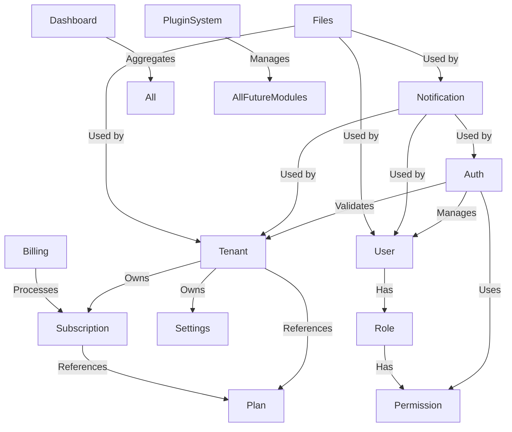

# Module Breakdown

## Overview
This document outlines the modular structure of the Dexo Platform, distinguishing between core MVP modules (essential for launch) and future/modules that will be added in later phases via the plugin system.

## Core MVP Modules (Phase 1 - Launch)
These modules are essential for the platform to function and will be included in the initial release.

### 1. Auth Module
**Responsibility**: Authentication, authorization, and user management
**Key Functions**:
- User registration, login, logout
- Password reset and email verification
- Multi-factor authentication (MFA)
- JWT token generation and validation
- Social login integrations (Google, GitHub, etc.)
- Session management
- Remember-me functionality
**Interfaces**:
- Public API endpoints for auth flows
- Internal services for other modules to validate permissions
- Webhook events for auth-related activities

### 2. Tenant Module
**Responsibility**: Tenant lifecycle management and tenant-specific configuration
**Key Functions**:
- Tenant creation, activation, suspension, cancellation
- Subdomain and custom domain management
- Tenant-level settings and preferences
- Plan association and subscription linking
- Resource usage tracking per tenant
- Tenant provisioning and deprovisioning
**Interfaces**:
- Admin portal for tenant management
- Self-service portal for tenant administrators
- API for programmatic tenant management
- Events for tenant lifecycle hooks

### 3. User Module
**Responsibility**: User profile management and user-tenant relationships
**Key Functions**:
- User profile CRUD operations
- User invitation and onboarding workflows
- Profile visibility and privacy controls
- User preferences and settings
- User status management (active, inactive, locked)
- Impersonation capabilities (for admin support)
- User search and filtering
**Interfaces**:
- Profile management APIs
- Integration with Auth module for user lookup
- Admin bulk user management tools
- User directory functionality

### 4. Role Module
**Responsibility**: Role definition and role-based access control administration
**Key Functions**:
- Role creation, editing, deletion
- Permission assignment to roles
- Role hierarchy and inheritance (future)
- System vs custom role distinction
- Role templates for common job functions
- Role assignment auditing
**Interfaces**:
- Role management APIs
- Integration with Permission module
- Admin UI for role administration
- RBAC decision engine interfaces

### 5. Permission Module
**Responsibility**: Fine-grained permission definition and management
**Key Functions**:
- Permission definition (resource/action pairs)
- Permission grouping and categorization
- System-defined vs custom permissions
- Permission effectiveness evaluation
- Permission conflict resolution
- Permission usage analytics
**Interfaces**:
- Permission definition APIs
- Low-level permission checking services
- Integration with Role and Auth modules
- Audit logging for permission changes

### 6. Subscription Module
**Responsibility**: Subscription lifecycle and billing plan management
**Key Functions**:
- Plan creation and management
- Subscription creation, modification, cancellation
- Trial management and conversion
- Renewal and expiration handling
- Proration calculations
- Usage-based billing foundations
- Subscription analytics and reporting
**Interfaces**:
- Billing module integration
- Plan management APIs
- Customer-facing subscription portal
- Webhook subscription events
- Usage tracking interfaces

### 7. Billing Module
**Responsibility**: Payment processing, invoicing, and financial operations
**Key Functions**:
- Payment method management (credit cards, bank transfers)
- Invoice generation and delivery
- Payment processing (via Stripe/PayPal/etc.)
- Failed payment handling and retries
- Refund and credit management
- Tax calculation and VAT/GST support
- Revenue recognition and reporting
- Payment reconciliation
**Interfaces**:
- Payment gateway integrations
- Invoice generation APIs
- Customer billing portal
- Accounting system exports
- Webhook payment events
- Financial reporting interfaces

### 8. Notification Module
**Responsibility**: Multi-channel notification delivery and template management
**Key Functions**:
- Template creation and management (email, SMS, push, in-app)
- Notification queuing and delivery
- Channel-specific providers (SMTP, Twilio, FCM, etc.)
- Delivery tracking and analytics
- Template personalization and variables
- Notification preferences per user
- Rate limiting and spam prevention
**Interfaces**:
- Notification sending APIs
- Template management UI
- Provider integration abstractions
- Webhook delivery callbacks
- Preference management APIs
- Analytics and reporting interfaces

### 9. Files Module
**Responsibility**: File upload, storage, and management
**Key Functions**:
- Secure file upload handling
- Metadata storage and indexing
- S3-compatible object storage integration
- Access control and permissions
- File versioning (future)
- Virus scanning and content validation
- CDN integration for public files
- Usage tracking and storage quotas
**Interfaces**:
- File upload/download APIs
- Metadata query services
- Storage provider abstractions
- Webhook file events
- Admin file management tools
- Storage analytics and reporting

### 10. Settings Module
**Responsibility**: System-wide and tenant-specific configuration management
**Key Functions**:
- Global system configuration
- Tenant-level settings override
- Feature flags per tenant
- Integration configuration (webhooks, APIs)
- Branding and theming settings
- Localization and formatting preferences
- Security and compliance settings
- API rate limiting and quotas
**Interfaces**:
- Settings CRUD APIs
- Admin configuration UI
- Runtime configuration service
- Validation and sanitization services
- Export/import configuration tools
- Change audit logging

### 11. Plugin System Module
**Responsibility**: Dynamic module loading and extension framework
**Key Functions**:
- Plugin discovery and loading
- Plugin lifecycle management
- Hook system for extensibility
- Plugin marketplace interfaces
- Plugin permission and security sandboxing
- Plugin version compatibility checking
- Plugin installation/update/uninstallation
- Plugin dependency resolution
**Interfaces**:
- Plugin registration APIs
- Hook invocation services
- Plugin management UI
- Marketplace browsing and installation
- Version compatibility checking
- Security scanning for plugins

### 12. Dashboard Module
**Responsibility**: Administrative overview and analytics visualization
**Key Functions**:
- System health overview
- Key metrics display (users, tenants, revenue)
- Real-time activity feeds
- Quick access to common admin tasks
- Customizable dashboard widgets
- Role-based dashboard views
- Export and reporting capabilities
**Interfaces**:
- Dashboard widget APIs
- Layout persistence services
- Data source abstraction layer
- Real-time update mechanisms
- Export functionality (PDF, CSV, etc.)
- Integration with Analytics module

## Future Modules (Phase 2+ - Via Plugin System)
These modules will be developed as plugins and can be enabled/disabled per tenant.

### Industry-Specific Modules
- **Fitness Center**: Class scheduling, member check-in, equipment tracking, trainer management
- **Education/School**: Student management, gradebook, attendance, parent-teacher communication
- **Healthcare/Clinic**: Patient records, appointment scheduling, billing, HIPAA compliance tools
- **Restaurant**: Table reservations, menu management, inventory, POS integration
- **Salon/Spa**: Appointment booking, staff scheduling, product inventory, customer history
- **Hotel**: Room reservations, housekeeping scheduling, guest management, rate management
- **Service Companies**: Job scheduling, time tracking, invoicing, customer CRM
- **Subscription Businesses**: Recurring billing, churn analysis, subscriber management
- **NGO/Nonprofit**: Donation management, volunteer tracking, grant management, impact reporting
- **ERP Customers**: Inventory management, procurement, supply chain, financial reporting

### Horizontal Feature Modules
- **Chat/Messaging**: Real-time tenant/user communication, support tickets, internal team chat
- **Video Conferencing**: Integrated video meetings, webinar capabilities, recording and sharing
- **Document Collaboration**: Real-time document editing, version control, approval workflows
- **Project Management**: Task boards, Gantt charts, resource allocation, milestone tracking
- **Marketing Automation**: Email campaigns, lead scoring, customer journey mapping, A/B testing
- **HR/Payroll**: Employee management, time off tracking, payroll processing, benefits administration
- **Inventory Management**: Stock tracking, purchase orders, vendor management, barcode scanning
- **Point of Sale (POS)**: Retail transactions, inventory sync, customer loyalty, receipt printing
- **E-commerce Storefront**: Product catalog, shopping cart, checkout, order management, returns
- **Accounting Integration**: QuickBooks/Xero sync, general ledger, financial statements, tax reporting
- **AI Integration Layer**: Natural language processing, predictive analytics, recommendation engines, chatbots

## Module Characteristics
Each module follows these characteristics:

### Independence
- Minimal direct dependencies on other modules
- Communication through well-defined events and APIs
- Encapsulated business logic and data models
- Independent versioning and release cycles

### Interfaces
- **API Layer**: RESTful endpoints for external consumption
- **Event Publishers**: Emits domain events for other modules to consume
- **Event Subscribers**: Listens to relevant events from other modules
- **Shared Types**: Common data structures in @dexo/shared package
- **Configuration**: Tenant-specific settings via Settings module

### Data Ownership
- Each module owns its database tables
- Foreign key references use tenant_id for isolation
- No direct database access between modules (via APIs only)
- Eventual consistency patterns for cross-module data

### Lifecycle
- **Installation**: Plugin system registers module capabilities
- **Initialization**: Module sets up databases, creates default data
- **Activation**: Module becomes available based on tenant features/plan
- **Deactivation**: Module gracefully shuts down, preserves data
- **Uninstallation**: Module cleans up after itself (configurable)

### Security
- Each module enforces its own authorization checks
- Input validation and sanitization at module boundaries
- Secure by default principles applied
- Regular security audits per module
- Dependency scanning for module dependencies

## Module Dependencies (MVP)

## Development Guidelines for Modules
1. **API First**: Define API contracts before implementation
2. **Event Driven**: Use events for cross-module communication
3. **Database Per Module**: Each module owns its tables
4. **Shared Kernel**: Common utilities in @dexo/shared
5. **Configuration via Settings**: Tenant-specific behavior configurable
6. **Observable**: Proper logging, metrics, and tracing
7. **Testable**: Unit, integration, and contract tests
8. **Documented**: API docs, architecture decisions, user guides
9. **Backward Compatible**: Version APIs appropriately
10. **Secure**: Authentication, authorization, input validation

## Migration Path to Microservices
Each module is designed to be extractable as an independent service:
1. **Current**: Module as NestJS module in monorepo
2. **Intermediate**: Module as independent NestJS application sharing database
3. **Advanced**: Module as independent service with its own database
4. **Eventual**: Module as polyglot microservice using best-fit technology

The shared database approach in MVP allows for clean separation later by:
- Adding service-specific database connections
- Implementing saga patterns for cross-service transactions
- Using event streaming for inter-service communication
- Deploying modules independently via Kubernetes